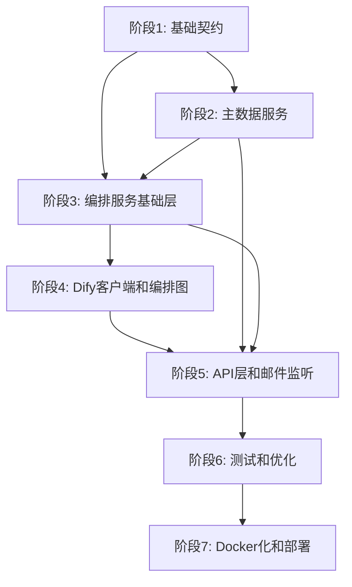

# MCS 平台实施计划

## 环境要求

### Python 版本

- **Python 版本**: `3.12`（必需）
- **Conda 环境**: `mcs-platform`
- 所有服务和库必须兼容 Python 3.12

### 核心依赖包（Python 3.12 兼容）

#### 共享库 (libs/contracts)

- `pydantic>=2.0.0` - 支持 Python 3.12
- `pydantic-settings>=2.0.0` - 支持 Python 3.12
- `typing-extensions>=4.8.0` - 支持 Python 3.12

#### 编排服务 (mcs-orchestrator)

- `langgraph>=0.2.0` - 支持 Python 3.12
- `langserve>=0.1.0` - 支持 Python 3.12
- `fastapi>=0.104.0` - 支持 Python 3.12
- `uvicorn[standard]>=0.24.0` - 支持 Python 3.12
- `sqlalchemy>=2.0.0` - 支持 Python 3.12
- `psycopg[binary]>=3.1.0` - 支持 Python 3.12
- `httpx>=0.25.0` - 支持 Python 3.12（异步 HTTP 客户端）
- `rapidfuzz>=3.0.0` - 支持 Python 3.12
- `redis>=5.0.0` - 支持 Python 3.12
- `prometheus-client>=0.19.0` - 支持 Python 3.12
- `jinja2>=3.1.0` - 支持 Python 3.12

#### 主数据服务 (mcs-masterdata)

- `fastapi>=0.104.0` - 支持 Python 3.12
- `uvicorn[standard]>=0.24.0` - 支持 Python 3.12
- `sqlalchemy>=2.0.0` - 支持 Python 3.12
- `psycopg[binary]>=3.1.0` - 支持 Python 3.12
- `redis>=5.0.0` - 支持 Python 3.12
- `alembic>=1.12.0` - 支持 Python 3.12

#### 邮件监听服务 (mcs-email-listener)

- `fastapi>=0.104.0` - 支持 Python 3.12
- `uvicorn[standard]>=0.24.0` - 支持 Python 3.12
- `aiosmtplib>=3.0.0` - 支持 Python 3.12
- `apscheduler>=3.10.0` - 支持 Python 3.12
- `httpx>=0.25.0` - 支持 Python 3.12
- `sqlalchemy>=2.0.0` - 支持 Python 3.12
- `psycopg[binary]>=3.1.0` - 支持 Python 3.12

#### 开发工具

- `pytest>=7.4.0` - 支持 Python 3.12
- `pytest-asyncio>=0.21.0` - 支持 Python 3.12
- `ruff>=0.1.0` - 支持 Python 3.12（linting 和 formatting）
- `black>=23.0.0` - 支持 Python 3.12（可选，ruff 已包含格式化）

### 版本兼容性说明

- 所有列出的包版本均经过验证，支持 Python 3.12
- 使用 `pyproject.toml` 管理依赖，明确指定 Python 版本要求：`requires-python = ">=3.12"`
- 在创建 conda 环境时使用：`conda create -n mcs-platform python=3.12`

## 架构概览

系统包含三个核心服务和一个共享库：

- **libs/contracts**: 共享数据契约（Pydantic 模型）
- **mcs-masterdata**: 主数据管理服务（RESTful API + 缓存）
- **mcs-email-listener**: 邮件监听/拉取服务
- **mcs-orchestrator**: 编排服务（LangGraph + LangServe）

## 实施阶段

### 阶段 1: 基础契约和基础设施（1-2周）

**目标**: 建立共享契约和基础设施，为后续服务提供基础

#### 1.1 创建项目结构

- 创建 `mcs-platform/` 目录结构
- 初始化各服务的 `pyproject.toml`
  - 所有 `pyproject.toml` 必须指定：`requires-python = ">=3.12"`
  - 使用 PEP 621 标准格式
- 设置 monorepo 工作空间配置
- 创建 conda 环境：`conda create -n mcs-platform python=3.12`

#### 1.2 实现 libs/contracts

**文件**: [libs/contracts/src/mcs_contracts/](libs/contracts/src/mcs_contracts/)

- `common.py`: 通用类型、错误结构、StatusEnum
- `email_event.py`: EmailEvent、EmailAttachment 模型
- `masterdata.py`: Customer、Contact、Company、Product、MasterData 模型
- `results.py`: 所有 Result 类型（ContactMatchResult、DifyContractResult 等）
- `orchestrator.py`: OrchestratorRunResult、StatusEnum
- `tests/test_schema_examples.py`: 模型验证测试

**验证**: 所有模型可通过 Pydantic 验证，测试用例通过

#### 1.3 数据库基础设施

- 设置 PostgreSQL 数据库
- 配置 Alembic 迁移工具
- 创建基础迁移脚本模板

---

### 阶段 2: 主数据服务（1-2周）

**目标**: 实现主数据管理服务，提供 CRUD API 和缓存机制

#### 2.1 数据库模型和迁移

**文件**: [services/mcs-masterdata/src/mcs_masterdata/db/models.py](services/mcs-masterdata/src/mcs_masterdata/db/models.py)

- 定义 Customer、Contact、Company、Product ORM 模型
- 定义 MasterDataVersion 模型（版本控制）
- 创建索引（email、customer_id、customer_num）
- 生成 Alembic 迁移脚本

#### 2.2 数据访问层

**文件**: [services/mcs-masterdata/src/mcs_masterdata/db/repo.py](services/mcs-masterdata/src/mcs_masterdata/db/repo.py)

- 实现 CRUD 操作
- 批量更新接口
- 版本管理逻辑

#### 2.3 缓存实现

**文件**: [services/mcs-masterdata/src/mcs_masterdata/cache/](services/mcs-masterdata/src/mcs_masterdata/cache/)

- `redis_cache.py`: Redis 缓存实现（带版本检查）
- `memory_cache.py`: 内存缓存（开发环境）
- 缓存失效和刷新机制

#### 2.4 API 层

**文件**: [services/mcs-masterdata/src/mcs_masterdata/api/](services/mcs-masterdata/src/mcs_masterdata/api/)

- `routes.py`: RESTful API 端点
- GET `/v1/masterdata/customers|contacts|companies|products`
- GET `/v1/masterdata/all` (返回完整 MasterData)
- GET `/v1/masterdata/version` (版本号)
- POST `/v1/masterdata/customers|contacts` (创建/更新)
- PUT `/v1/masterdata/bulk` (批量更新)
- `main.py`: FastAPI 应用入口
- `deps.py`: 依赖注入（数据库会话、缓存）

#### 2.5 配置和错误处理

**文件**: [services/mcs-masterdata/src/mcs_masterdata/](services/mcs-masterdata/src/mcs_masterdata/)

- `settings.py`: 配置管理（DB_DSN、REDIS_URL、CACHE_TTL）
- `errors.py`: 错误码定义
- `schemas.py`: API 请求/响应模型

**验证**:

- API 测试通过
- 缓存命中率测试
- 版本控制测试

---

### 阶段 3: 编排服务基础层（1-2周）

**目标**: 实现编排服务的基础设施（数据库、工具、可观测性）

#### 3.1 数据库模型和迁移

**文件**: [services/mcs-orchestrator/src/mcs_orchestrator/db/models.py](services/mcs-orchestrator/src/mcs_orchestrator/db/models.py)

- OrchestrationRun 模型
- IdempotencyRecord 模型
- AuditEvent 模型
- 生成 Alembic 迁移脚本

#### 3.2 数据访问层

**文件**: [services/mcs-orchestrator/src/mcs_orchestrator/db/repo.py](services/mcs-orchestrator/src/mcs_orchestrator/db/repo.py)

- `create_run()`: 创建运行记录
- `update_run_status()`: 更新状态
- `write_audit_event()`: 写入审计事件
- `get_idempotency_record()`: 查询幂等记录
- `upsert_idempotency_record()`: 更新/插入幂等记录
- `find_run_by_message_id()`: 按 message_id 查询

#### 3.3 Checkpoint Store

**文件**: [services/mcs-orchestrator/src/mcs_orchestrator/db/checkpoint/](services/mcs-orchestrator/src/mcs_orchestrator/db/checkpoint/)

- `postgres_checkpoint.py`: PostgreSQL checkpoint 实现
- 实现 LangGraph CheckpointSaver 接口
- 状态快照存储和恢复
- 定期清理策略
- `redis_checkpoint.py`: Redis checkpoint（可选）

#### 3.4 工具层

**文件**: [services/mcs-orchestrator/src/mcs_orchestrator/tools/](services/mcs-orchestrator/src/mcs_orchestrator/tools/)

- `masterdata_client.py`: 主数据服务客户端（带缓存）
- `file_server.py`: 文件上传封装
- `similarity.py`: 相似度匹配（RapidFuzz）
- `mailer.py`: 邮件发送（SMTP/Jinja2 模板）

#### 3.5 可观测性

**文件**: [services/mcs-orchestrator/src/mcs_orchestrator/observability/](services/mcs-orchestrator/src/mcs_orchestrator/observability/)

- `settings.py`: 配置管理
- `errors.py`: 错误码定义
- `logging.py`: 统一日志格式
- `redaction.py`: 数据脱敏
- `retry.py`: 重试装饰器（指数退避）
- `metrics.py`: Prometheus metrics
- `monitoring.py`: 健康检查和告警
- `langsmith.py`: LangSmith tracing

**验证**:

- 数据库操作测试
- Checkpoint 存储/恢复测试
- 工具单测通过

---

### 阶段 4: Dify 客户端和编排图（1-2周）

**目标**: 实现 Dify 客户端和 LangGraph 编排图

#### 4.1 Dify 客户端

**文件**: [services/mcs-orchestrator/src/mcs_orchestrator/tools/dify_client.py](services/mcs-orchestrator/src/mcs_orchestrator/tools/dify_client.py)

- 异步调用支持
- 重试机制（使用 @retry_with_backoff）
- JSON 输出解析和修复
- 文件 remote_url 支持

#### 4.2 Graph Registry

**文件**: [services/mcs-orchestrator/src/mcs_orchestrator/graphs/registry.py](services/mcs-orchestrator/src/mcs_orchestrator/graphs/registry.py)

- GraphInfo 数据类
- GraphRegistry 注册表
- 版本管理

#### 4.3 Sales Email State

**文件**: [services/mcs-orchestrator/src/mcs_orchestrator/graphs/sales_email/state.py](services/mcs-orchestrator/src/mcs_orchestrator/graphs/sales_email/state.py)

- SalesEmailState 定义（TypedDict 或 Pydantic）
- 辅助函数（add_error、add_warning）

#### 4.4 节点实现

**文件**: [services/mcs-orchestrator/src/mcs_orchestrator/graphs/sales_email/nodes/](services/mcs-orchestrator/src/mcs_orchestrator/graphs/sales_email/nodes/)按顺序实现：

1. `check_idempotency.py`: 幂等性检查（第1步）
2. `load_masterdata.py`: 加载主数据（从服务，带缓存）
3. `match_contact.py`: 联系人匹配
4. `detect_contract_signal.py`: 合同信号检测
5. `match_customer.py`: 客户匹配
6. `upload_pdf.py`: PDF 上传
7. `call_dify_contract.py`: 调用 Dify 合同识别
8. `call_dify_order_payload.py`: 调用 Dify 订单生成
9. `call_erp_gateway.py`: 调用 ERP 网关
10. `notify_sales.py`: 通知销售
11. `finalize.py`: 最终化

#### 4.5 审计装饰器

**文件**: [services/mcs-orchestrator/src/mcs_orchestrator/graphs/sales_email/nodes/persist_audit.py](services/mcs-orchestrator/src/mcs_orchestrator/graphs/sales_email/nodes/persist_audit.py)

- `@audit_decorator` 装饰器实现
- 自动记录节点输入/输出
- 异步写入（不阻塞）

#### 4.6 Graph 构建

**文件**: [services/mcs-orchestrator/src/mcs_orchestrator/graphs/sales_email/graph.py](services/mcs-orchestrator/src/mcs_orchestrator/graphs/sales_email/graph.py)

- `build_sales_email_graph()`: 构建 LangGraph
- 节点连接和条件边
- Checkpoint store 集成
- 错误处理逻辑

**验证**:

- 节点单元测试
- Graph 集成测试（mock Dify/ERP）
- 条件边测试

---

### 阶段 5: API 层和邮件监听服务（1周）

**目标**: 实现编排服务 API 和邮件监听服务

#### 5.1 编排服务 API

**文件**: [services/mcs-orchestrator/src/mcs_orchestrator/api/](services/mcs-orchestrator/src/mcs_orchestrator/api/)

- `main.py`: FastAPI 应用初始化
- `routes.py`: 
- POST `/v1/orchestrations/sales-email/run`
- POST `/v1/orchestrations/sales-email/replay`
- GET `/v1/healthz`
- `deps.py`: 依赖注入
- `middleware.py`: 中间件（request_id、日志、异常处理）
- `schemas.py`: API 请求/响应模型

#### 5.2 邮件监听服务

**文件**: [services/mcs-email-listener/src/mcs_email_listener/](services/mcs-email-listener/src/mcs_email_listener/)

- `settings.py`: 配置（邮箱连接、轮询间隔）
- `listeners/imap_listener.py`: IMAP 监听实现
- `fetcher.py`: 邮件拉取和解析
- `parser.py`: 邮件解析（附件提取）
- `scheduler.py`: 定时任务调度（APScheduler）
- `api/routes.py`: Webhook 接收、手动触发
- `db/models.py`: 邮件记录模型
- `db/repo.py`: 邮件记录查询

**验证**:

- API 端点测试
- 邮件监听功能测试（mock 邮箱）
- 端到端测试（邮件 -> orchestrator）

---

### 阶段 6: 测试和优化（1周）

**目标**: 完善测试覆盖，优化性能

#### 6.1 单元测试

**文件**: [services/mcs-orchestrator/tests/](services/mcs-orchestrator/tests/)

- `test_graph_happy_path.py`: 成功路径测试
- `test_graph_fail_paths.py`: 失败路径测试
- `test_idempotency.py`: 幂等性测试
- `test_retry.py`: 重试机制测试
- `test_checkpoint.py`: Checkpoint 测试

#### 6.2 集成测试

- 端到端测试（所有服务）
- Mock Dify 和 ERP 服务
- 并发测试
- 性能测试

#### 6.3 文档

**文件**: [docs/](docs/)

- `runbook.md`: 运维手册
- API 文档（OpenAPI）
- 部署指南

---

### 阶段 7: Docker 化和部署（1周）

**目标**: 容器化和部署准备

#### 7.1 Docker 化

**文件**: [services/*/docker/](services/)

- 各服务的 Dockerfile
  - 基础镜像：`python:3.12-slim`
  - 确保使用 Python 3.12
- docker-compose.yaml（包含所有服务）
- 环境变量配置

#### 7.2 部署配置

- K8s 部署清单（可选）
- 环境变量模板
- 监控配置（Prometheus、Grafana）

---

## 依赖关系图

## 关键决策点

1. **Checkpoint Store 选择**: PostgreSQL（推荐）vs Redis（性能更好但数据可能丢失）
2. **缓存策略**: Redis（生产）vs 内存缓存（开发）
3. **邮件协议**: 优先支持 IMAP，Exchange 作为备选
4. **异步处理**: 所有节点使用 async/await，Dify 调用异步化

## 风险缓解

1. **Dify 输出格式**: 实现 JSON 解析重试和修复机制
2. **主数据一致性**: 使用版本控制和缓存失效策略
3. **邮件重复处理**: 使用邮件记录表避免重复
4. **状态丢失**: Checkpoint store 确保状态持久化

## 成功标准

- [ ] 所有服务可独立运行和测试
- [ ] 端到端流程测试通过（邮件 -> 订单）
- [ ] 性能指标达标（响应时间 < 10s，并发 > 50 req/s）