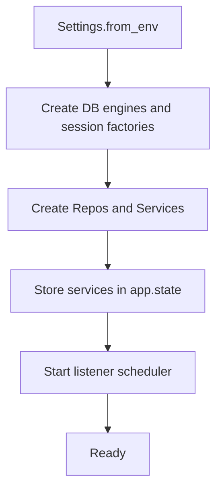

# MCS 架构

## 顶层结构概览

```
mcs-platform/
  services/
    mcs-orchestrator/          # Python: LangGraph + LangServe
    mcs-toolkit/               # Python: 可复用 tools（文件上传、相似度、dify client）
    mcs-erp-gateway/           # 可选：Python封装ERP（或由现有NestJS提供）
  gateway/
    nestjs-api/                # NestJS: 权限裁剪/统一鉴权/路由
  libs/
    contracts/                 # JSON Schema / OpenAPI / Pydantic models
  infra/
    docker/
    k8s/
  docs/
```

---

## 系统生命周期（Orchestrator 应用）

编排服务（orchestrator）的启动与关闭由 FastAPI `lifespan` 管理（见 `mcs-platform/orchestrator/src/api/main.py`）。

### 启动顺序

1. **加载配置**：`Settings.from_env()` 读取环境变量与 `.env`。
2. **创建数据库引擎与 Session 工厂**：编排库、主数据库、监听器库各建 engine 与 session factory。
3. **创建服务与依赖**：MasterDataRepo、MasterDataService、GatewayService、OrchestrationRepo、DifyClient、FileServerClient、Mailer、OrchestrationService、ListenerRepo、ListenerService。
4. **挂载路由与中间件**：RequestId、Logging、Exception、CORS；注册 orchestration、gateway、masterdata、listener 路由。
5. **启动 Listener 调度器**：`listener_service.start_scheduler()`。



### 关闭顺序

1. **停止 Listener 调度器**：`listener_service.stop_scheduler()`。
2. **退出 lifespan**：FastAPI/Uvicorn 关闭连接，进程退出。

### 热重载

当前**未实现**配置热重载。关键配置（数据库 DSN、外部 API URL、密钥等）变更需**重启进程**。

---

## 高风险修改

以下修改影响兼容性或全局行为，修改前需评估并做回归测试。

| 类型 | 说明 |
|------|------|
| **Contracts 稳定字段** | `libs/contracts` 对外暴露的模型字段（尤其是 stable_keys：message_id、idempotency_key、customer_id、contact_id、file_url、sales_order_no、order_url 等）。字段重命名/删除/类型变更会破坏调用方与编排图。 |
| **编排图 state 稳定键** | `SalesEmailState` 及各图 state 的键名与类型。节点依赖这些键，变更需同步改节点与测试。 |
| **idempotency_key 语义** | 幂等键的生成规则、去重窗口、同键返回行为。变更会影响重复请求与审计追溯。 |
| **NestJS 网关与编排的接口契约** | 网关调用的编排 URL、请求体、响应体。须与 [orchestration-protocol.md](orchestration-protocol.md) 及 [nestjs-api.md](nestjs-api.md) 保持一致。 |

---

## 不变式

所有实现必须满足以下约束，与 [.cursor/rules/namespace.mdc](../.cursor/rules/namespace.mdc) 一致。

| 不变式 | 说明 |
|--------|------|
| **幂等接口** | 所有会产生副作用的编排入口（run、replay、manual-review/submit）必须接受并校验幂等语义（run 由服务端按 message_id 等生成幂等键；replay 提供 message_id 或 idempotency_key；submit 提供 run_id）。同键应返回已有结果或拒绝重复提交。 |
| **审计** | 每次编排运行必须可审计，审计记录包含 `run_id` 与终态（final status）。与 db/models、checkpoint 等一致。 |
| **节点对外契约** | 节点只通过 contracts 的 Result 模型或抛出 `OrchestratorError` 与外部/下游通信，不返回裸 dict 或未定义结构。 |
